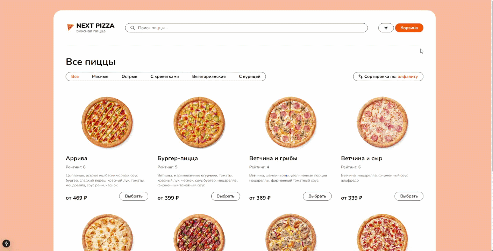

# Next Pizza



## Project Description
Next Pizza is a modern web application for ordering pizza, built with Next.js. The project demonstrates skills in developing frontend applications with a dynamic interface and online ordering capabilities.

## Core Features
- View menu items and ingredients
- Add pizzas to the cart
- Place an order
- Responsive design for mobile devices
- Interactive user interface

## Architecture
The project is built on [Next.js](https://nextjs.org/), a React framework for server-side rendering and static site generation, which enhances performance and SEO.

State management is handled with [Zustand](https://github.com/pmndrs/zustand), a small, fast, and scalable bearbones state-management solution.

The project follows the [Feature-Sliced Design](https://feature-sliced.design/) architecture pattern, which organizes the codebase into clear, feature-oriented slices. This structure enhances maintainability, scalability, and separation of concerns by dividing the application into independent feature modules, each containing its own UI, logic, and data layers.


## Testing
The project includes testing with:
- [Jest](https://jestjs.io/docs/getting-started) — for unit testing components and functions
- [React Testing Library](https://testing-library.com/docs/react-testing-library/intro/) — for testing user interactions and UI

## Installation

1. Download the repo with:
```
$ git clone https://github.com/rgdzv/next-pizza.git
```
2. Install dependencies
```
$ npm install
```
3. Run server
```
$ npm run server:start
```
4. Run app:
```
$ npm run dev
```
5. Open your browser to http://localhost:3000